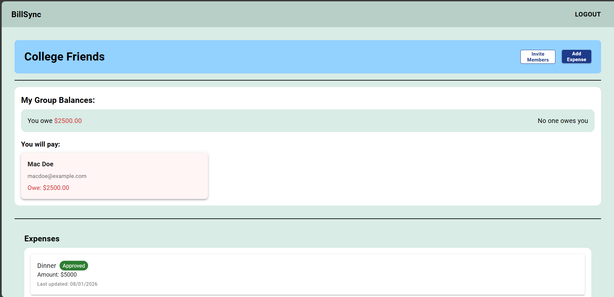
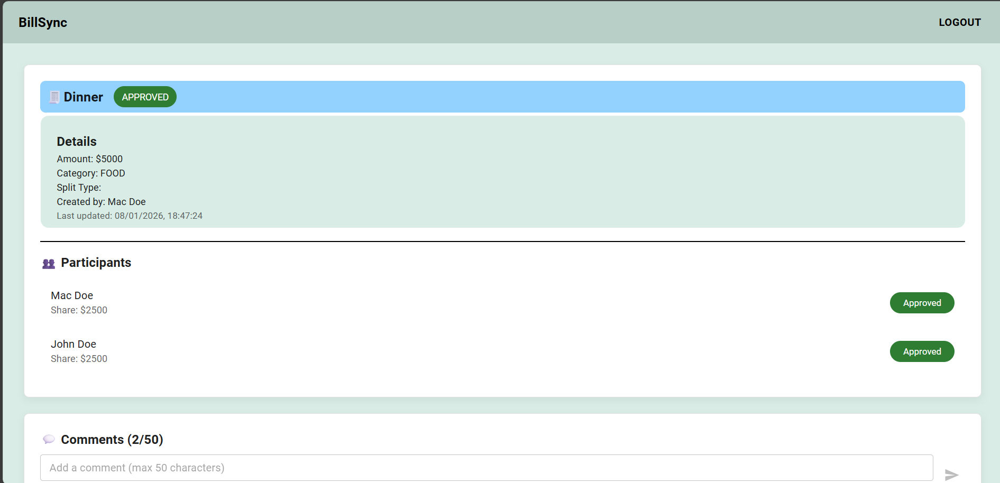
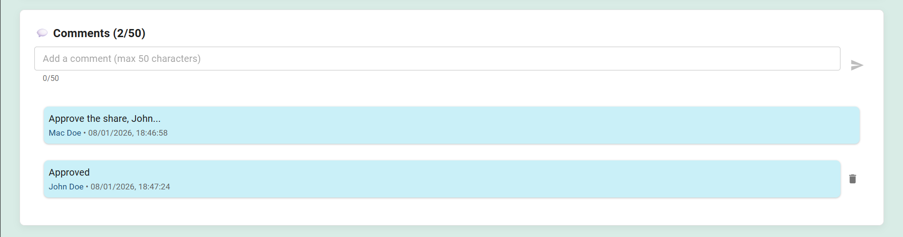
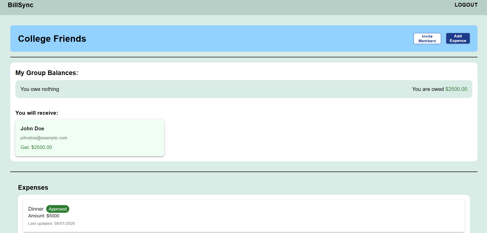

# 💰 BillSync

A full-stack **Expense Sharing & Bill Splitting Platform** designed to help groups of friends, roommates, or colleagues track shared expenses, split bills fairly, and settle balances seamlessly.

🔗 **Live App:** [https://billsync-phi.vercel.app](https://billsync-phi.vercel.app)
🔗 **Backend API:** [https://billsync-43tt.onrender.com](https://billsync-43tt.onrender.com)
🔗 **GitHub Repository:** [https://github.com/CodePhantom01/BillSync_Deploy](https://github.com/CodePhantom01/BillSync_Deploy)

---

---

## 📸 Application Screenshots

<p align="center">
  
  
</p>

<p align="center">
  
  
</p>

<p align="center">
  
</p>


## ✨ Features

* 🔐 Secure JWT authentication (Login / Signup)
* 👥 Create and manage expense groups
* 💸 Add expenses with categories (Food, Transport, Entertainment, Shopping, Others)
* ✅ Expense approval system for fair bill splitting
* 💬 Comment on expenses for better communication
* 📧 Group invitations via unique invitation links
* 💰 Automatic balance calculation and settlement tracking
* 📊 View detailed expense breakdowns and group balances
* 🎨 Modern UI built with Material-UI (MUI)

---

## 🛠️ Tech Stack

### Frontend

* React 18
* Material-UI (MUI) & Emotion
* React Router DOM
* Axios

### Backend

* Node.js, Express.js
* MongoDB Atlas, Mongoose
* JWT Authentication, Bcrypt
* CORS

---

## 🚀 Getting Started

### Prerequisites

* Node.js (v14+)
* MongoDB Atlas or Local MongoDB

### Installation

```bash
git clone https://github.com/CodePhantom01/BillSync_Deploy.git
cd BillSync_Deploy
```

```bash
# Backend
cd Backend
npm install
```

```bash
# Frontend
cd ../Frontend
npm install
```

---

## 🔑 Environment Variables

### Backend (`Backend/.env`)

```env
PORT=4000
MONGO_URI=your_mongodb_atlas_uri
JWT_SECRET=your_jwt_secret
```

### Frontend (`Frontend/.env`)

```env
REACT_APP_API_URL=https://billsync-43tt.onrender.com/api
# For local development: REACT_APP_API_URL=http://localhost:4000/api
```

⚠️ **Never commit real credentials to GitHub.**
Reference: [https://docs.github.com/en/code-security](https://docs.github.com/en/code-security)

---

## ▶️ Running the Application

```bash
# Backend (from Backend directory)
npm run dev
```

```bash
# Frontend (from Frontend directory)
npm start
```

---

## 📁 Project Structure

```bash
BillSync_Deploy/
├── Backend/
│   ├── config/
│   │   └── db.js
│   ├── controllers/
│   │   ├── authController.js
│   │   ├── commentController.js
│   │   ├── expenseController.js
│   │   ├── groupController.js
│   │   ├── invitationController.js
│   │   └── transactionController.js
│   ├── middlewares/
│   │   └── authMiddleware.js
│   ├── models/
│   │   ├── Comment.js
│   │   ├── Expense.js
│   │   ├── Group.js
│   │   ├── Invitation.js
│   │   ├── Settlement.js
│   │   ├── Transaction.js
│   │   └── User.js
│   ├── routes/
│   │   ├── authRoutes.js
│   │   ├── commentRoutes.js
│   │   ├── expenseRoutes.js
│   │   ├── groupRoutes.js
│   │   ├── invitationRoutes.js
│   │   └── transactionRoutes.js
│   ├── index.js
│   └── package.json
│
├── Frontend/
│   ├── public/
│   │   ├── index.html
│   │   └── ...
│   ├── src/
│   │   ├── components/
│   │   │   ├── CreateGroup.js
│   │   │   ├── ExpenseDetailsPage.js
│   │   │   ├── ExpenseItem.js
│   │   │   ├── GroupItem.js
│   │   │   ├── GroupPage.js
│   │   │   ├── GroupsList.js
│   │   │   ├── HomePage.js
│   │   │   ├── JoinGroup.js
│   │   │   ├── Login.js
│   │   │   ├── LoginPage.js
│   │   │   ├── Navbar.js
│   │   │   └── RegisterPage.js
│   │   ├── services/
│   │   │   ├── API.js
│   │   │   └── groupService.js
│   │   ├── App.js
│   │   ├── index.js
│   │   └── ...
│   └── package.json
│
└── README.md
```

---

## 🔀 Authentication & Routing

* JWT token stored in `localStorage`
* Protected routes redirect unauthenticated users to login
* Token automatically included in API requests via Axios interceptors

---

## 🔌 REST API Endpoints

### Auth Routes (`/api/auth`)

* `POST /register` - User registration
* `POST /login` - User login
* `GET /current-user` - Get current authenticated user *(Protected)*

### Group Routes (`/api/groups`)

* `POST /create` - Create a new group *(Protected)*
* `POST /join/:invitationId` - Join a group via invitation *(Protected)*
* `GET /get/:groupId` - Get group details by ID *(Protected)*
* `GET /get` - Get all groups for current user *(Protected)*
* `POST /invite` - Send group invitation *(Protected)*
* `GET /:groupId/balances` - Get group balance calculations *(Protected)*

### Expense Routes (`/api/expenses`)

* `POST /create` - Create a new expense *(Protected)*
* `POST /approve` - Approve an expense *(Protected)*
* `GET /get/:expenseId` - Get expense details by ID *(Protected)*
* `DELETE /delete/:expenseId` - Delete an expense *(Protected)*
* `POST /:expenseId/comments` - Add comment to expense *(Protected)*
* `DELETE /:expenseId/comments/:commentId` - Delete a comment *(Protected)*

### Transaction Routes (`/api/transactions`)

* `POST /add` - Add a settlement transaction *(Protected)*

### Invitation Routes (`/api/invitations`)

* `POST /create` - Create a new invitation *(Protected)*
* `GET /:invitationId` - Get invitation details
* `POST /:invitationId/accept` - Accept an invitation *(Protected)*

### Comment Routes (`/api/comments`)

* `POST /add` - Add a comment *(Protected)*
* `GET /:expenseId` - Get all comments for an expense *(Protected)*

---

## 🔒 Security

* JWT-based authentication
* Password hashing using bcrypt
* Protected API routes with authentication middleware
* CORS configuration for secure cross-origin requests

Best practices:
[https://expressjs.com/en/advanced/best-practice-security.html](https://expressjs.com/en/advanced/best-practice-security.html)

---

## 💡 Key Features Explained

### Expense Approval System

* Expenses require approval from participants before being finalized
* Participants can approve or reject their share of an expense
* Only approved expenses are included in balance calculations

### Balance Calculation

* Automatically calculates who owes whom in each group
* Supports multiple currencies (configurable per group)
* Tracks settlements and remaining balances

### Group Invitations

* Generate unique invitation links for groups
* Share links with friends to join groups easily
* Secure invitation acceptance with authentication

---

## 🗄️ Database

* MongoDB Atlas (Cloud Database)
* Mongoose ODM
* Secure environment-based configuration

Docs:
[https://www.mongodb.com/atlas/database](https://www.mongodb.com/atlas/database)

---

## 🧪 Test Users

For testing purposes, you can use these test accounts:

```json
{
  "name": "John Doe",
  "email": "johndoe@example.com",
  "password": "johndoe@example.com"
}
```

```json
{
  "name": "Mac Doe",
  "email": "macdoe@example.com",
  "password": "macdoe@example.com"
}
```

---

## ❤️ Built With MERN Stack

---

* GitHub: [@CodePhantom01](https://github.com/CodePhantom01)
